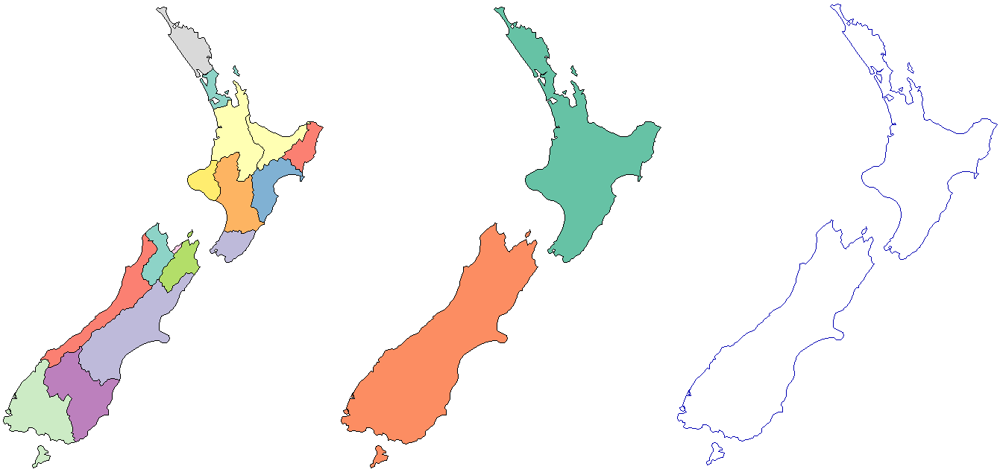

```{r setup, include = FALSE}
knitr::opts_chunk$set(
  collapse = TRUE,
  comment = "#>"
)
```

# Introduction

**RPyGeo** establishes an interface to the geoprocessing tools of ArcGIS from within R.
Since ArcGIS only provides a Python API for a low-level access of its C++ based geoalgorithms, **RPyGeo** establishes a tunnel to Python via the **reticulate** package.
This extends R's spatial capabilities [@bivand_applied_2013; @hijmans_raster_2017; @pebesma_simple_2018] by the geoalgorithms and the geoprocessing power of ArcGIS.
Combining this with the statistical and data science power of R opens the way to advanced console-base statistical geoprocessing [@muenchow_rqgis_2017]. 

To use **RPyGeo** properly, at least a basic understanding of **ArcPy** is necessary.
ArcPy is a Python side-package that allows geographic data analysis through ArcGIS from the Python command line.
ArcPy is organized into modules which are Python files with functions and classes. The ArcPy main module `arcpy` (or `arcgis` module in ArcGIS API for Python) provides (geographic) classes and several hundred functions.
Further modules (e.g., `data access`) and extensions (e.g., `spatial analysis`) further extend the ArcPy main module.
We do recommend to get familiar with ArcPy through the official [help pages](https://pro.arcgis.com/en/pro-app/arcpy/main/arcgis-pro-arcpy-reference.htm). 
There also several books available on ArcGIS and ArcPy such as 
@zandbergen_python_2013 and @pimpler_programming_2015.

# Tutorial

In order to use **RPyGeo** you need a working ArcMap or ArcGIS Pro installation on your computer. 
In addition, this tutorial requires the following packages to be installed and attached.

```{r, eval=FALSE}
library("RPyGeo")
library("sf")
library("raster")
library("magrittr")
```

**spData** and **RQGIS** must also be installed since we will use the raster object `dem` and the vector object `nz` from these packages to demonstrate both raster and vector operations.
To make these datasets available for the subsequent ArcMap geoprocessing, we have to save them on disk first.
Therefore, we export `nz` and `dem` to a temporary directory.

```{r, eval = FALSE}
data(dem, package = "RQGIS")
data(nz, package = "spData")
writeRaster(dem, file.path(tempdir(), "dem.tif"), format = "GTiff")
st_write(nz, file.path(tempdir(), "nz.shp"))
```

## Establishing the ArcPy Python interface in R

Powered by **reticulate**, `rpygeo_build_env()` will establish an R interface to Python.
ArcPy will only work with the Python binary that comes with the ArcGIS installation.
If this Python binary is not installed in the default location (`C:/Python27` in the case of ArcMap and `C:/Program Files/ArcGIS/Pro/bin/Python/envs/arcgispro-py3` in the case of ArcGIS Pro), one has to set it explicitly with the `path` parameter of `rpygeo_build_env()`. 
Secondly, `rpygeo_build_env()` loads the `arcpy` modules.

```{r, eval = FALSE}
arcpy <- rpygeo_build_env(workspace = tempdir(),
                          overwrite = TRUE,
                          extensions = "Spatial")
```

`rpygeo_build_env()` lets the user also specify further common ArcGIS environment settings.
For instance, setting `overwrite` to `TRUE` lets the user overwrite already existing spatial objects later on with outputs created by ArcPy geoalgorithms.
The `extensions` parameter allows also the activation of extensions.^[The availability of extensions is dependent on the purchased ArcGIS license.] The keywords for the `extension` parameter are listed on the ArcGIS [help page](http://desktop.arcgis.com/de/arcmap/10.3/analyze/arcpy-functions/checkoutextension.htm). 
In the code chunk above, we have enabled the Spatial Analysis extension.
The `workspace` parameter defines the default directory where to save the outputs of geoprocessing functions and in which to look for spatial objects. 
Note that the workspace can be a directory or an ESRI file geodatabase.^[If you work with large raster files we would recommend to use a directory, because it takes a long time to load raster datasets from a file geodatabase into an R session.]
A scratch workspace folder is automatically created inside the workspace. 
The scratch workspace usually contains the output files of functions that do not explicitly provide an output parameter as is the case for most spatial analyst raster algorithms.
To change the default scratch workspace location, use parameter `scratch_workspace`.

## Find out about ArcPy functionality

`rpygeo_search()` is a helper function to find out about the commandline name of all ArcGIS geoalgorithms at our disposal.
`rpygeo_search()` returns all available algorithms that contain the term specified in `search_term` in their name. 
The search term can be plain text or a regular expression.
For example, to find all ArcPy functions that contain `Classify` in their name, we can type: 

```{r, eval=FALSE}
rpygeo_search(search_term = "Classify")
#> $toolbox
#> [1] "ClassifyLasByHeight_3d" "ClassifyLasGround_3d"   "Reclassify_3d"         
#>
#> $sa
#> [1] "ClassifyRaster" "MLClassify"     "Reclassify"    
#>
#> $main
#> [1] "ClassifyLasByHeight_3d" "ClassifyLasGround_3d"   "Reclassify_3d"         
#> 
#> $ddd
#> [1] "ClassifyLasByHeight" "ClassifyLasGround"   "Reclassify"
```

The search result list is divided according to the corresponding modules of the functions (see section [Modules and extensions](#modules-and-extensions)).

If `search_term` remains unspecified all available functions of the corresponding module will be returned.

`rpygeo_help()` helps to get familiar with the function parameters of a specific ArcGIS geoalgorithm.

```{r, eval=FALSE}
rpygeo_help(arcpy$Slope_3d)
```

The help file is displayed in the viewer pane of RStudio.
If you use RPyGeo in another IDE, the help file is displayed in the default browser.

## Geoprocessing with ArcPy

ArcPy functions of the main module can be accessed via the `$` operator.
Taking advantage of the (tab) code completion feature of RStudio, all functions of the ArcPy module are listed after typing the `$` operator (which represents an interactive alternative to `rpygeo_search()`).
(Tab) code completion will also list the available function parameters for a specific function, e.g. for `arcpy$Slope_3d()`.
We will use `arcpy$Slope_3d()` to compute the slope from the digital elevation model (DEM) we have exported at the beginning of this tutorial:

```{r, eval=FALSE}
arcpy$Slope_3d(in_raster = "dem.tif", out_raster = "slope.tif")
#>C:\Users\janne\AppData\Local\Temp\RtmpyWYrL1\slope.tif
```

Executing the function creates a file named `slope.tif` in the workspace directory, which in our case is the temporary folder (see above in `rpygeo_build_env()`).
To import the output of the ArcGIS processing into R, run:

```{r, eval=FALSE}
slope <- rpygeo_load("slope.tif")
plot(slope)
```

```{r slope, echo=FALSE, fig.cap="Slope computed with `Slope_3d()`"}
knitr::include_graphics("slope.png")
```

This imports and plots the ArcGIS slope processing output into R as a raster object named `slope` (Figure \@ref(fig:slope)).

The pipe operator `%>%` can be used to chain ArcPy function together. 

```{r, eval = FALSE}
arcpy$Dissolve_management(in_features = "nz.shp", 
                          out_feature_class = "nz_island.shp", 
                          dissolve_field = "Island") %>%
  arcpy$PolygonToLine_management("nz_border.shp")
#>C:\Users\janne\AppData\Local\Temp\RtmpqGHdyf\nz_border.shp
```

In this example the `nz.shp` shapefile is dissolved based on the `Island` field.
Subsequently, the polygons are converted into polylines (see Figure \@ref(fig:nz)).


```{r nz, echo=FALSE, fig.cap="Regions of `nz` (left), `nz` polygons dissolved by island (middle), `nz` polygons converted to lines (right).", out.width="75%"}

```

## Modules and extensions

To use the functions of a specific extension, one has to enable the extension first (see `rpygeo_build_env()`). 
To access an extension we can also make use of the `$` operator.
Then, a second `$` provides access to the functions of the extension.
For example, to compute the slope from a DEM with the help of the Spatial Analyst extension, we can run:

```{r, eval=FALSE}
arcpy$sa$Slope(in_raster = "dem.tif")
#>C:\Users\janne\AppData\Local\Temp\RtmpqGHdyf/scratch\Slope_dem1.tif
```

Note that there is no output parameter, hence the result of the processing will be saved as an Arc/Info Binary Grid file to the scratch workspace location (see again `rpygeo_build_env()`).
To save the output to another location, we can make use of `rpygeo_save()`.
Here, we save the output of the slope processing to the workspace we have defined in the beginning with `rpygeo_build_env()` which was a temporary directory created with `tempdir()`:

```{r, eval=FALSE}
arcpy$sa$Slope(in_raster = "dem.tif") %>%
  rpygeo_save("slope.tif")
```

## Map algebra

Map algebra expressions can be used in **RPyGeo** with special operators. 
The four basic calculus functions are implemented as `%rpygeo_+%`, `%rpygeo_-%`, `%rpygeo_*%`, `%rpygeo_/%`. 

```{r, eval=FALSE}

ras <- arcpy$sa$Raster("dem.tif") 
class(ras)
#>"python.builtin.Raster" "python.builtin.object"

ras %rpygeo_+% 2 %>%
  rpygeo_save("dem_2.tif")
```

In this example, `arcpy$sa$Raster()` first creates a Python raster object, which is linked to a temporary Esri Arc/Info Binary Grid stored in the scratch workspace.
Using `%rpygeo_+%` we added 2 to each pixel value. 
For map algebra the `rpygeo_save()` and `rpygeo_load()` functions are very handy, because the output of map algebra operations is always a temporary file. 

# Conclusions

Please note that we could not test each ArcPy function.
Therefore, if you encounter any bugs please report them through the issue tracker of our [github repository](https://github.com/fapola/RPyGeo/) or help us fix them via a pull request.

# References
